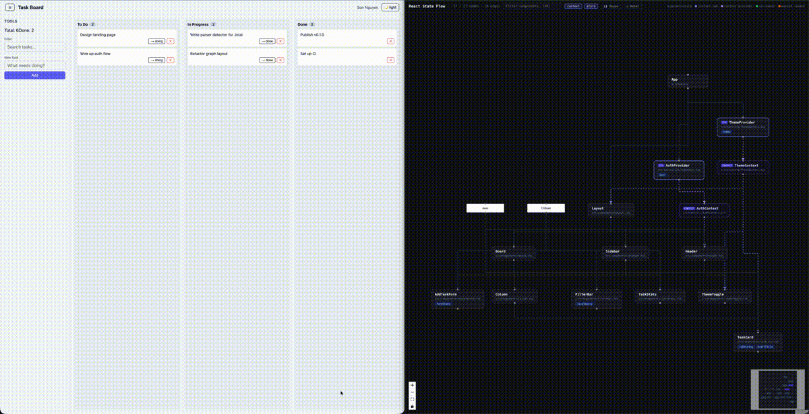

# react-state-flow

[](https://www.npmjs.com/package/react-state-flow)
[](LICENSE)
[](package.json)

Visualize React component state and re-render flow in real time.

Parses your React codebase into an interactive graph, then overlays live render data from your running app — so you can see which components re-render, how often, how state flows through the tree, and **which re-renders are wasted**.



## Why not React DevTools?

| | React DevTools Profiler | react-state-flow |
|---|---|---|
| Shows component structure | ✗ (tree list only) | ✓ interactive graph |
| Redux / Zustand edges | ✗ | ✓ |
| Context edges | ✗ | ✓ |
| Always-on (no record needed) | ✗ | ✓ |
| Persists across browser refresh | ✗ | ✓ history replay |
| Wasted render detection | ✗ | ✓ orange highlight |
| Click node → jump to source | ✗ | ✓ |

## How it works

1. **Static analysis** — scans your source files and builds a component graph (components, contexts, Redux/Zustand stores, parent-child relationships)
2. **Runtime instrumentation** — hooks into React DevTools to capture render events without modifying your components
3. **Live visualization** — renders an interactive graph in the browser, updated in real time as your app runs

## Installation

```bash
npm install react-state-flow
```

## Usage

### Step 1 — Add runtime instrumentation

Import at the very top of your `main.tsx` (before React mounts):

```ts
import 'react-state-flow/runtime'
import { StrictMode } from 'react'
import { createRoot } from 'react-dom/client'
import App from './App'

createRoot(document.getElementById('root')!).render(
  <StrictMode>
    <App />
  </StrictMode>
)
```

The runtime is automatically disabled in production (`NODE_ENV=production` or Vite's `MODE=production`), so this import is safe to commit.

### Step 1b — Optional: enable exact runtime IDs in Vite

Zero-config mode is safe by default, but duplicate component names are treated conservatively: if two different files both export `Button`, runtime badges are hidden for those ambiguous names instead of being attached to the wrong node.

If you want exact runtime tracking for duplicate names, add the optional Vite plugin:

```ts
import { defineConfig } from 'vite'
import react from '@vitejs/plugin-react'
import { reactStateFlowVitePlugin } from 'react-state-flow/vite'

export default defineConfig({
  plugins: [reactStateFlowVitePlugin(), react()],
})
```

### Step 2 — Run the CLI

```bash
npx react-state-flow ./src
```

The browser opens automatically at `http://localhost:7272` with your component graph. Start your app and the graph updates live as components render.

## CLI

```bash
react-state-flow [directory] [options]
```

| Argument / Option | Default | Description |
|---|---|---|
| `directory` | `.` | Path to your React source directory |
| `--port=<n>` | `7272` | Port for the CLI server |
| `--no-open` | — | Skip auto-opening the browser |
| `--ignore=<names>` | — | Extra directory names to skip, comma-separated (e.g. `tests,fixtures`) |
| `--editor=<name>` | `vscode` | Editor for click-to-open: `vscode`, `cursor`, `webstorm`, `zed` |

The CLI defaults to port `7272`; override with `--port`. Your app's Vite dev server can run on any other port.

## What the graph shows

- **Component nodes** — each React function component (and class component), with its `useState`/`useReducer` state slots listed
- **Context nodes** — each `createContext` call
- **Store nodes** — Redux (`configureStore`/`createStore`) and Zustand (`create()`) stores
- **Parent-child edges** — JSX render relationships between components
- **Context provision edges** — which component renders a `Context.Provider`
- **Context subscription edges** — which components call `useContext`
- **Store-subscription edges** — which components use `useSelector`/`useDispatch` or a Zustand hook
- **Render counts** — live badge on each node showing how many times it has rendered
- **Render flash** — green highlight for 800ms after a component re-renders
- **Wasted renders** — orange highlight when a component re-renders but its props and state haven't changed; cumulative wasted count badge shown top-left, and replayed after browser refresh

Click any component or context node to open it in your editor at the exact source line.

The graph updates automatically when you save source files (no restart needed).

## Supported state managers

| Library | Detection |
|---|---|
| React built-in | `useState`, `useReducer` |
| React Context | `createContext`, `useContext`, `Context.Provider` |
| Redux Toolkit | `configureStore`, `createStore`, `useSelector`, `useDispatch` (single-store exact, multi-store shown as `ReduxStore?`) |
| Zustand | `create()` + any `useXxxStore` hook |

## Pause & reset

The header has two controls that affect render tracking globally:

- **❚❚ Pause / ▶ Resume** — temporarily stops processing live render events in the UI. Counts and highlights freeze; the graph is still interactive. The runtime keeps sending events; they're discarded until you resume.
- **↺ Reset** — clears render counts and wasted-render counts everywhere (UI, server history, runtime in your app). Useful when you want to reproduce an interaction with a clean baseline.

## Search & filter

Use the search bar (or press `⌘K` / `Ctrl+K`) to filter nodes by name. Toggle the **context** and **store** chips to show/hide those node types.

## Requirements

- Node.js 18+
- React 16.8+ (hooks required for DevTools hook support)

## Advanced

**Override port in runtime** — if you run the CLI on a custom port, set `window.__RSF_PORT__` before the import:

```ts
;(window as any).__RSF_PORT__ = 8080
import 'react-state-flow/runtime'
```

**Consume render events programmatically:**

```ts
import type { RenderEvent } from 'react-state-flow/runtime'
```

**Runtime identity modes**

- Zero-config mode resolves runtime events by component name only when that name is unique in the current graph.
- Duplicate names stay hidden instead of being attached to the wrong node.
- `react-state-flow/vite` upgrades runtime events with exact `componentId`s so duplicate names render correctly too.

## License

MIT
